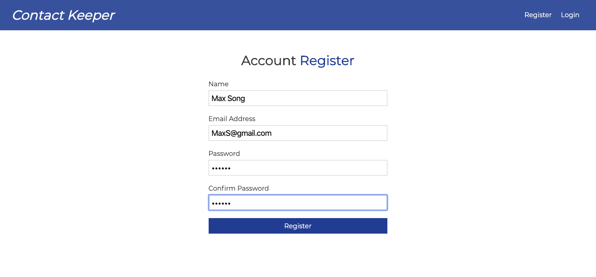
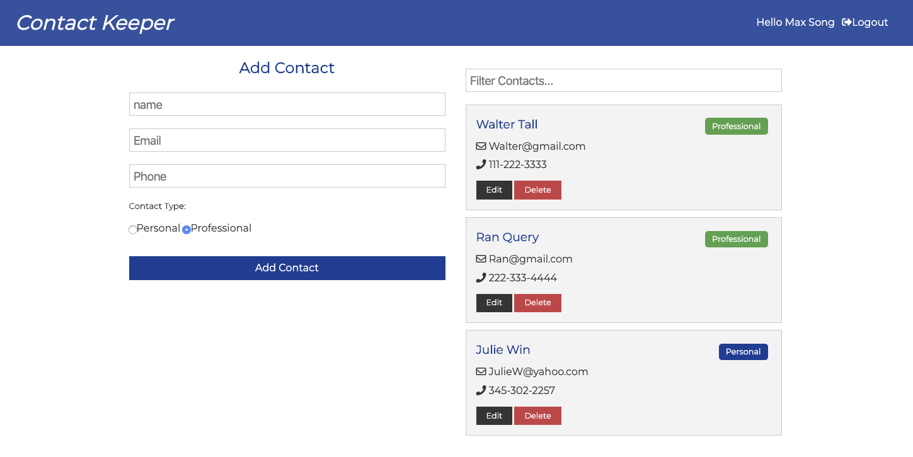
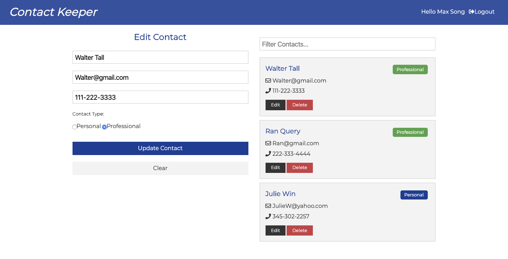
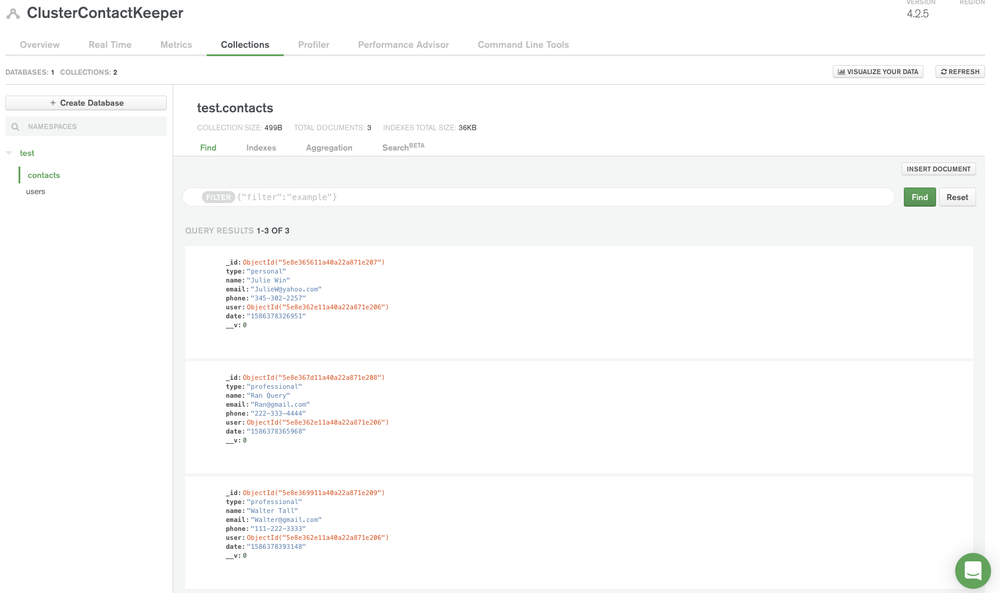
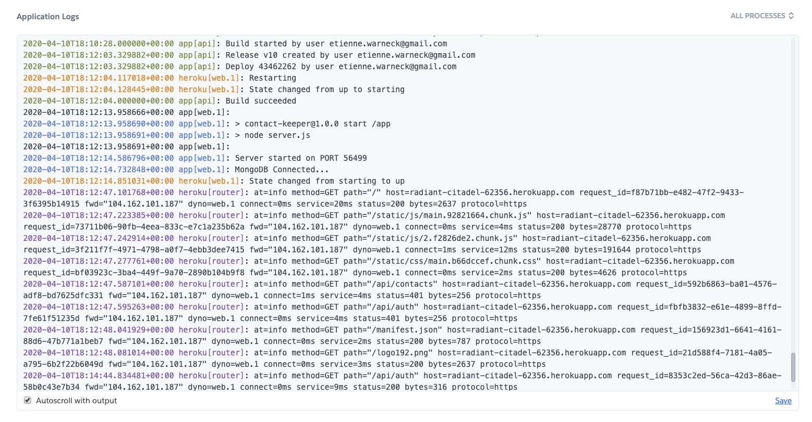

# contactkeeperudemy

A full stack MERN application using MongoDB.Atlas, React hooks, Express and Node from a Udemy tutorial called React Back to Front by Brad Traversy to learn the best practices with React 16.8+

Tools: React Hooks (useState, useEffect, useContext, useReducer, useRef), MongoDB & Mongoose, Express, JWT (JSON Web Token) for authentication, Node and Heroku for the deployment.

If you wish to test the app, visit the Heroku link: https://radiant-citadel-62356.herokuapp.com/login#!

Registration page:

Adding and updating contacts:

Cluster on MongoDB.Atlas:

Deployment successfully achieved with Heroku:

